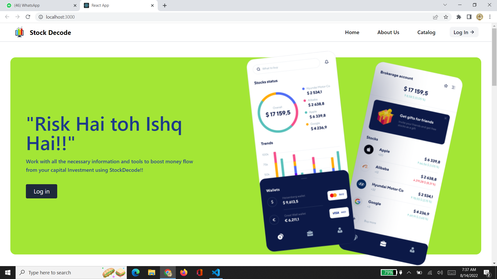
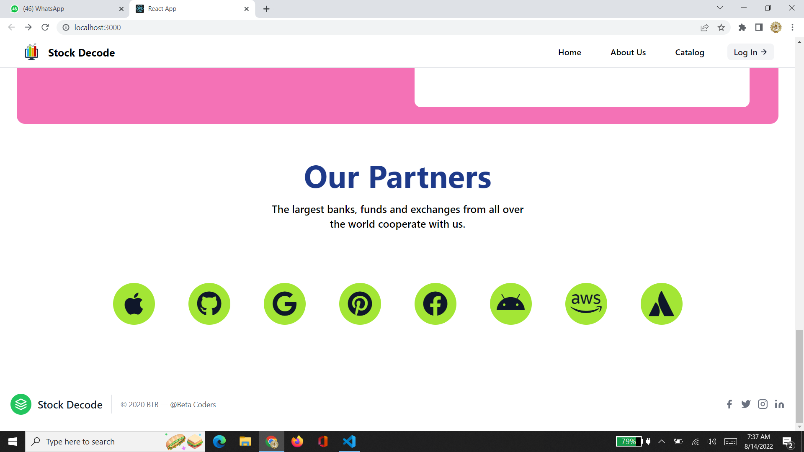

# Stock-Management

The intention to make this project is to spreade awareness for 
 stock-market to share holders or investors. To make this project
 more attractive and colourfull we are using REACT App
  as a frontend, Node js as a backend, mondoDB as a 
  database and Tailwind as a css. We also tried to make website responsive.

  
## Tech Stack

Here we use these technical components :


**Client:** React,  TailwindCSS

**Server:** Node, Express, MongoDB


## Deployment

To make REACT App use this commands

```bash
  npm run deploy
```

And then after you should write your code by changing directory. for set-up Tailwind.css use this command

```
npm install -D tailwindcss postcss autoprefixer

npx tailwind init -p
```
To use database we have choosen Mongodb by installing "mongoose"
and "express".

# MondoDB Functionality : 

For mongoDB we are using various collections like users, favusers,
todo for modifications 
through different schemas. 

Here for signup and login data we use user collection for storing data and for
selected stocks as favourite stock we use favusers collection,
for todo list we use todo collection.

If user will signup through their data it will store in users collection and
if user will try to login data will be search in user collection 
and give response according to the conditions like email and password
must be match to login.
## Screenshots






